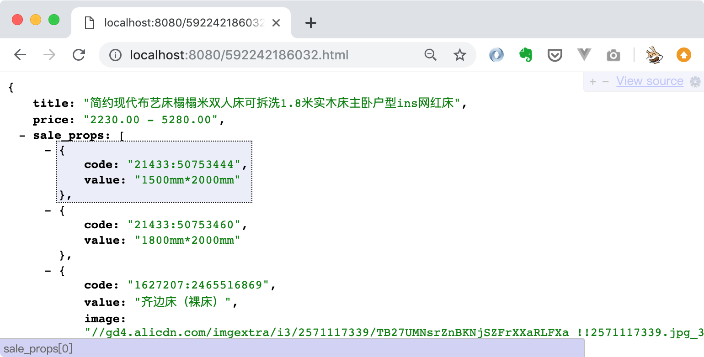

## 部署
确保在机器上安装了docker,在项目目录下执行
```
docker build -t go18 .
```

使用`docker images`查看编译好的镜像   


在项目目录下执行以下命令启动容器:
```
docker run -d --name taobaoitem \
-p 8080:8080 \
-v $(pwd):/go/src/app \
-v $(pwd)/packages:/go/src/ go18
```
$(pwd)指项目根目录


## 使用帮助
访问[http://localhost:8080/592242186032.html](http://localhost:8080/592242186032.html)



---

MIT License